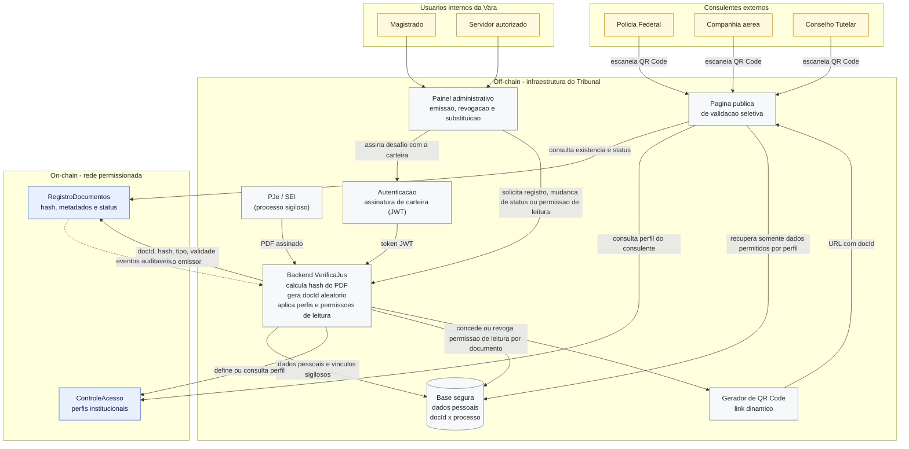

# Arquitetura - VerificaJus Sigilo

## Visao geral

## Fluxo principal

1. O magistrado ou servidor autoriza-se no painel assinando um desafio com a carteira; o backend valida a assinatura e emite um token JWT.
2. A Vara expede um alvara de viagem ou termo de guarda no PJe/SEI.
3. O backend recebe o PDF assinado, calcula o hash, gera um `docId` aleatorio e grava os dados sigilosos na base segura do Tribunal.
4. O contrato `RegistroDocumentos` registra na blockchain apenas `docId`, hash, tipo, validade, orgao emissor e status inicial.
5. A aplicacao gera um QR Code dinamico apontando para a pagina de validacao.
6. Alem do perfil institucional, a Vara pode conceder ou revogar permissao de leitura para um consulente especifico em um documento especifico.
7. O consulente externo acessa a pagina, que consulta a blockchain para confirmar existencia e status do documento.
8. A pagina consulta a base off-chain e exibe somente os campos permitidos pelo perfil institucional e pelas permissoes de leitura concedidas ao consulente.

## Fronteira de dados

| Dado | Onde fica | Justificativa |
|---|---|---|
| Hash do PDF | On-chain | Prova de integridade sem expor o conteudo do documento |
| `docId` aleatorio | On-chain e off-chain | Identificador sem correlacao direta com o processo sigiloso |
| Tipo, validade, orgao emissor e status | On-chain | Metadados minimos para validacao auditavel |
| Eventos de registro, revogacao e substituicao | On-chain | Trilha auditavel e nao repudiavel |
| PDF completo | Off-chain | Documento sigiloso e volumoso |
| Nome da crianca, responsavel, guardiao ou acompanhante | Off-chain | Dado pessoal sensivel protegido por segredo de justica e LGPD |
| Numero completo do processo | Off-chain | Pode revelar informacao protegida pelo segredo de justica |
| Regras detalhadas de exibicao por perfil | Off-chain | Regras podem mudar e nao devem expor politica interna em dados publicamente legiveis |
| Log detalhado de consultas | Off-chain | Pode revelar metadados sensiveis; futura ancoragem por raiz de Merkle pode ser avaliada |

## Dados visiveis por perfil

| Perfil | Exemplo de dados visiveis |
|---|---|
| Policia Federal | Status, tipo, orgao emissor, crianca/adolescente, acompanhante, destino e periodo de validade |
| Companhia aerea | Status, crianca/adolescente, acompanhante autorizado, destino e validade da autorizacao de viagem |
| Conselho Tutelar | Status, tipo, orgao emissor, crianca/adolescente, guardiao/responsavel e vigencia |

## Decisoes iniciais

- A blockchain nao armazena dados pessoais diretamente.
- O contrato inteligente gerencia a existencia, o hash e o ciclo de vida do documento.
- A validacao publica sempre passa pelo backend, pois a exibicao seletiva depende de perfil e de dados off-chain.
- A rede alvo e permissionada, adequada ao contexto de segredo de justica e governanca institucional.
