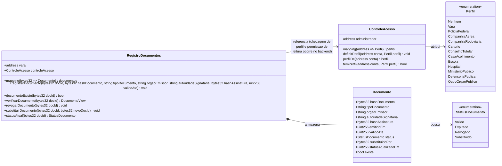

# Contratos inteligentes - VerificaJus Sigilo

## Diagrama de classes

## Responsabilidades

| Contrato | Responsabilidade |
|---|---|
| `RegistroDocumentos` | Registrar documentos sigilosos por hash, consultar existencia, retornar status e manter eventos auditaveis do ciclo de vida |
| `ControleAcesso` | Manter perfis institucionais que poderao ser usados pela aplicacao para filtrar informacoes exibidas |

## Funcao central desta entrega

A funcao relevante implementada nesta versao e `registrarDocumento`, que grava na blockchain o identificador aleatorio do documento, o hash do PDF e metadados minimos. A funcao `documentoExiste` permite verificar se um `docId` ja foi registrado.

O contrato ainda nao implementa todas as validacoes de producao. Controle fino de permissao, tratamento de casos de borda, integracao com QR Code e exibicao seletiva completa ficam para as proximas entregas.
